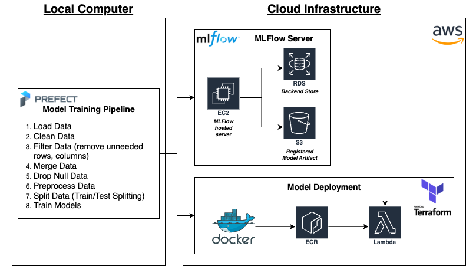
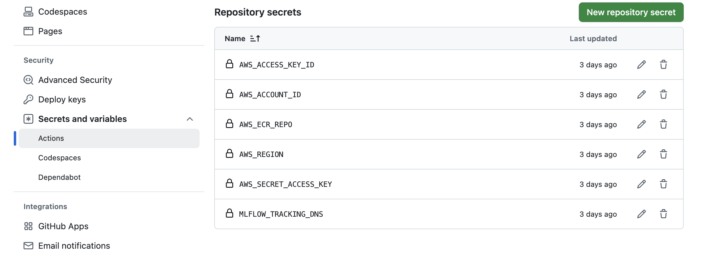
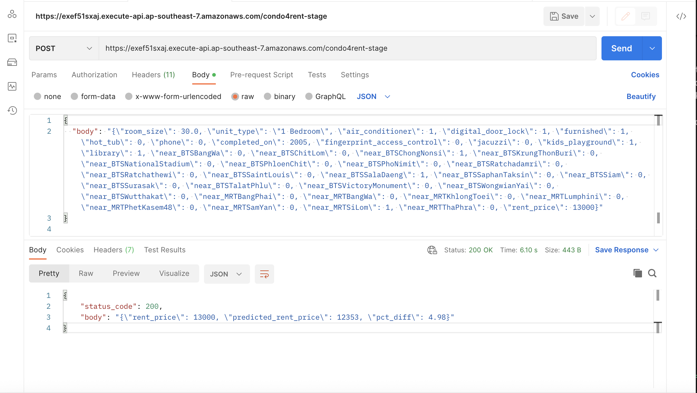

# MLOps Project: Bangkok Condo Rent Price Prediction

## 📄 Project Overview

This project focuses on building an MLOps pipeline to predict condominium rental prices in Bangkok. The primary goal is to provide users with a predicted rent price, along with the percentage change relative to the actual rental price, offering valuable insights for the real estate market. The prediction can be displayed with an actual rent price. This is advantageous to users who want to find a condo for rent to live in Bangkok with appropriate rent price.

This project is from the course organized by [DataTalks.Club](https://datatalks.club). Appreciated the instructors put so much effort on this course, so I can learnt MLOps related skillsets. You can refer the MLOps Zoomcamp here [link](https://github.com/DataTalksClub/mlops-zoomcamp).

### Problem Description

In the dynamic real estate market of Bangkok, accurately predicting condominium rental prices is a significant challenge. Factors such as location, size, amenities, and market fluctuations contribute to the complexity of determining a fair and competitive rental value. This project aims to address this problem by developing a robust machine learning model that can forecast condo rental prices.

The core objective is to deliver a prediction that not only estimates the rent price but also quantifies its deviation from the actual market price through a percentage change. This provides a clear, actionable metric for potential renters, landlords, and real estate professionals, helping them make informed decisions and identify potential discrepancies in pricing.

The project leverages a comprehensive dataset sourced from [Kaggle: Condominium Data in Bangkok](https://www.kaggle.com/datasets/krityodp/condominium-data-in-bangkok?resource=download). This raw data forms the foundation for the **Prefect Model Training Pipeline** (as depicted in the architecture diagram), where it undergoes a series of critical steps including loading, cleaning, filtering, merging, null data handling, preprocessing, and train/test splitting, ultimately leading to the training of the predictive models.

## ⚙️ Project Architecture

The architecture of this MLOps project is designed to leverage both local development for model training and the scalability and reliability of the cloud for experiment tracking, model management, and deployment. The diagram below illustrates the key components and their interactions:



As shown in the diagram, the project employs a hybrid approach:

**Local Computer:**
- **Prefect Model Training Pipeline:** The core model training logic, orchestrated by Prefect, runs locally. This pipeline consists of the following steps: Load Data, Clean Data, Filter Data, Merge Data, Drop Null Data, Preprocess Data, Split Data (Train/Test Splitting), and Train Models.

**Cloud Infrastructure (AWS):**
- **MLFlow Server:** For experiment tracking and model registry, an MLFlow server is hosted on an **EC2** instance. This server utilizes an **RDS** instance as its backend store for tracking metadata and **S3** for storing registered model artifacts. The local Prefect pipeline interacts with this MLFlow server to log experiments and register trained models.
- **Model Deployment:** The trained models are containerized using **Docker**. These Docker images are then pushed to **ECR (Elastic Container Registry)**. For scalable and cost-effective deployment, the model is served via **AWS Lambda**, with **Terraform** used for Infrastructure as Code (IaC) to provision and manage the necessary AWS resources for deployment.

The workflow involves training models locally using Prefect, leveraging MLFlow in the cloud to track the training process and register the best-performing models, and finally deploying these models to AWS Lambda using containerization and infrastructure automation with Terraform.

## 🛠️ Tools & Technology

The project leverages a range of powerful tools and technologies across different stages of the MLOps lifecycle:

**Orchestration & Pipeline Management:**
- **Prefect:** Used for defining, scheduling, and monitoring the model training pipeline locally.

**Cloud Infrastructure & Services (AWS):**
- **Amazon EC2:** For hosting the MLFlow server.
- **Amazon RDS:** As the backend database for the MLFlow server, storing experiment metadata.
- **Amazon S3:** For storing registered model artifacts managed by MLFlow.
- **Docker:** For containerizing the model deployment code, ensuring consistency across environments.
- **Amazon ECR (Elastic Container Registry):** As a secure and scalable Docker container registry.
- **AWS Lambda:** For deploying and serving the trained model as a serverless function.
- **Terraform:** For defining and managing the AWS infrastructure required for model deployment using Infrastructure as Code.

**Experiment Tracking & Model Registry:**
- **MLFlow:** Used for tracking experiment parameters, metrics, and artifacts, as well as for registering and managing trained models.

**Infrastructure as Code (IAC):**
- **Terraform**

**Data Handling & Machine Learning (used within the Prefect pipeline):**
- **Pandas**
- **Scikit-Learn**
- **Hyperopt**

**Other Framework:**
- **Unit Testing (pytest)**
- **Pre-commit** : code formatter (isort, black), pylint, pytest
- **CI/CD Pipeline:** Github Actions
- **Programming Language:** Python 3.10
- **Make:** Makefile

## ♻️ Reproducibility

This section provides comprehensive instructions on how to set up and run this project locally, ensuring that the results can be reproduced.

### 1. Data Acquisition

The raw dataset used for training is "Condominium Data in Bangkok," publicly available on Kaggle.
- **Source URL:** [https://www.kaggle.com/datasets/krityodp/condominium-data-in-bangkok?resource=download](https://www.kaggle.com/datasets/krityodp/condominium-data-in-bangkok?resource=download)
- **Download:** You will need a Kaggle account to download the `condo.zip` file.
- **Placement:** Once downloaded, extract the contents and place the primary data file (e.g., `condo.csv` or similar) into the `data/raw/` directory within this project's structure.

```
mlops_condo_rent_price_prediction/
├── train/
│   └── dataset/
│       └── 202306.xlsx  # <--- Place your downloaded data file here
└── ...
```

### 2. Prerequisites

Before running the project, ensure you have the following installed:
- **Python:** Version 3.9+ (It's recommended to use a virtual environment).
- **Pipenv:** If you use pipenv for dependency management. Otherwise, specify `pip`.
- **Docker:** Required for building and deploying the model container.
- **AWS CLI:** For interacting with AWS services (optional, but useful for local testing of cloud integrations like S3/ECR if not fully automated).
- **Terraform CLI:** If you intend to provision or modify the cloud infrastructure.
- **Make:** A build automation tool (typically pre-installed on Unix-like systems, available for Windows via tools like Git Bash or WSL).

### 3. Local Setup

Follow these steps to set up the project environment:

1.  **Clone the repository:**
```bash
git clone https://github.com/coo1y/mlops_condo_rent_price_prediction.git
cd mlops_condo_rent_price_prediction
```

2.  **Set up Python Environment and Install Dependencies:**
```bash
pip install pipenv
make setup
```

### 4. Setup the Prefect Cloud

The process is optional. The project can be executed locally. This is for on-cloud solution.

1. Sign up an account from Prefect Cloud v2 [link](https://app.prefect.cloud/auth/login)

2. Generate the API Key after create the workspace. Copy the API key after the creation.

3. Login into prefect on your terminals
```bash
prefect auth login -k <YOUR-API-KEY>
```

### 5. MLFlow Server Setup (Local/Cloud)

*(Choose one based on your primary setup for local reproduction)*

* **For local MLFlow server (if applicable for testing):**
```bash
# Example: If you want to run MLFlow tracking server locally for development
mlflow server --host 127.0.0.1 --port 5000 --backend-store-uri sqlite:///mlruns.db --default-artifact-root ./mlruns
```

* **For cloud-based MLFlow server (as per architecture):**
Ensure your AWS credentials are configured (e.g., via `aws configure`). The Prefect pipeline is configured to point to your cloud-hosted MLFlow server (EC2 with RDS/S3 backend).
- Install the MLFlow server according to [the source](https://github.com/DataTalksClub/mlops-zoomcamp/blob/main/02-experiment-tracking/mlflow_on_aws.md)

### 6. Running the Model Training Pipeline (Prefect)
**Execute the training pipeline using Makefile:**
1. Make sure specifying the .env `MLFLOW_TRACKING_DNS` to connect to the MLFlow server for an EC2 server.

2. From the root directory of the project, run:
```bash
make train_pipeline
```
This command will execute the Prefect flow responsible for data loading, cleaning, preprocessing, and model training. Experiments and trained models will be logged to the configured MLFlow server (as defined in your Prefect flow's environment or code).

## 🚀 Inference Pipeline and CI/CD

The model deployment and inference pipeline is managed through a robust Continuous Integration and Continuous Deployment (CI/CD) workflow, orchestrated using **GitHub Actions**. This ensures that a new, validated model can be deployed to the cloud with a high degree of automation and consistency.

### Workflow Summary

This CI/CD pipeline is automatically triggered on specific events (e.g., a push to the `main` branch or the creation of a new release tag) and performs the following key steps:

1.  **Containerization:** The inference code and the trained model are packaged into a reproducible **Docker** image. This container includes all necessary dependencies to serve predictions.
2.  **Image Push to ECR:** The newly built Docker image is tagged and pushed to **Amazon ECR (Elastic Container Registry)**. This makes the image available for deployment within the AWS ecosystem.
3.  **Infrastructure Deployment (IaC):** The pipeline uses **Terraform** to provision or update the necessary AWS infrastructure. This step is crucial, as it ensures that the infrastructure for model serving (e.g., the **AWS Lambda** function) is correctly configured and points to the latest Docker image in ECR.
4.  **Model Deployment:** The Terraform deployment updates the Lambda function's configuration to use the new Docker image, effectively deploying the new version of the model without manual intervention.

### Pipeline Location

The GitHub Actions workflow definition files can be found in the following location within the repository:

`/.github/workflows/`

This setup ensures a seamless transition from a registered model in MLFlow to a live, serverless prediction endpoint on AWS Lambda.

## 🚀 Inference Pipeline and CI/CD

The model deployment and inference pipeline are managed through robust Continuous Integration (CI) and Continuous Deployment (CD) workflows, orchestrated using **GitHub Actions**. This setup ensures that new code changes are validated, and new, validated models can be seamlessly deployed to the cloud with a high degree of automation and consistency.

The project utilizes two primary GitHub Actions workflows:

### 1. CI Pipeline: `CI-test`

* **Trigger:** This pipeline is automatically initiated on every **Pull Request (PR)** targeting the `main` branch. This ensures that all proposed code changes are thoroughly tested and validated before being merged into the main codebase.
* **Purpose:** To maintain code quality, perform automated testing, and validate infrastructure changes.
* **Key Steps:**
    * **Checkout Repository:** Fetches the code from the branch associated with the PR.
    * **Setup Python Environment:** Configures Python 3.10 and installs project dependencies using `pipenv`.
    * **Execute Unit Testing:** Runs unit tests located in `inference/tests/unit_test/` using `pytest` (`pipenv run pytest test_all.py`). This verifies the correctness of individual components of the inference service.
    * **Configure AWS Credentials:** Sets up AWS credentials for subsequent cloud-related steps.
    * **Terraform Plan:** Executes `terraform plan` within the `inference/infrastructure/` directory. This step provides a preview of infrastructure changes, ensuring that proposed infrastructure modifications are reviewed and do not introduce unintended side effects.
    * *Note: An integration testing step is commented out in the workflow but indicates the intention for future comprehensive testing of the deployed service.*

### 2. CD Pipeline: `CD-Deploy`

* **Trigger:** This pipeline is automatically initiated on every **push** to the `main` branch. This means that once a PR is merged into `main` (after passing CI), or direct pushes occur, the deployment process begins.
* **Purpose:** To automate the building, pushing, and deployment of the latest model inference service to the AWS cloud.
* **Key Steps:**
    * **Checkout Repository:** Fetches the latest code from the `main` branch.
    * **Configure AWS Credentials:** Sets up AWS credentials necessary for interacting with AWS services.
    * **Terraform Plan:** Performs another `terraform plan` to confirm infrastructure changes just before applying.
    * **Terraform Apply (Step 1 ECR):** Specifically designed to manage the Amazon ECR repository. This ensures the ECR repository is ready for the Docker image push.
    * **Login to Amazon ECR:** Authenticates Docker with your AWS Elastic Container Registry.
    * **Build Docker Image and Push to ECR:**
        * Builds the Docker image for the inference service locally.
        * Tags the image appropriately (`img_name:latest`).
        * Pushes the tagged Docker image to your designated ECR repository (`${{ env.AWS_ACCOUNT_ID }}.dkr.ecr.${{ env.AWS_REGION }}.amazonaws.com/${{ env.AWS_ECR_REPO }}:${{ env.IMAGE_TAG }}`).
    * **Terraform Apply (Step 2 Lambda):** Provisions or updates the AWS Lambda function to use the newly pushed Docker image from ECR. This effectively deploys the latest version of your trained model as a serverless API endpoint.

### Pipeline Locations

The GitHub Actions workflow definition files can be found in the following locations within the repository:

- CI Pipeline: `.github/workflows/ci-test.yml`
- CD Pipeline: `.github/workflows/cd-deploy.yml`

**Secure Configuration:** These pipelines securely utilize **GitHub Repository Secrets** to manage access to sensitive information. For the workflows to function correctly, the following secrets must be configured in your GitHub repository's settings (`Settings > Secrets and variables > Actions`):



* `AWS_ACCESS_KEY_ID`: AWS Access Key ID for authentication.
* `AWS_SECRET_ACCESS_KEY`: AWS Secret Access Key for authentication.
* `AWS_ACCOUNT_ID`: Your AWS account identifier.
* `AWS_ECR_REPO`: The name of your Elastic Container Registry repository.
* `AWS_REGION`: The AWS region where your resources are deployed.
* `MLFLOW_TRACKING_DNS`: The DNS name or IP address of your MLFlow Tracking Server.

## Example

### Request

This is an example of a request into the AWS Lambda function:

```
{
    "body": "{\"room_size\": 30.0, \"unit_type\": \"1 Bedroom\", \"air_conditioner\": 1, \"digital_door_lock\": 1, \"furnished\": 1, \"hot_tub\": 0, \"phone\": 0, \"completed_on\": 2005, \"fingerprint_access_control\": 0, \"jacuzzi\": 0, \"kids_playground\": 1, \"library\": 1, \"near_BTSBangWa\": 0, \"near_BTSChitLom\": 0, \"near_BTSChongNonsi\": 1, \"near_BTSKrungThonBuri\": 0, \"near_BTSNationalStadium\": 0, \"near_BTSPhloenChit\": 0, \"near_BTSPhoNimit\": 0, \"near_BTSRatchadamri\": 0, \"near_BTSRatchathewi\": 0, \"near_BTSSaintLouis\": 0, \"near_BTSSalaDaeng\": 1, \"near_BTSSaphanTaksin\": 0, \"near_BTSSiam\": 0, \"near_BTSSurasak\": 0, \"near_BTSTalatPhlu\": 0, \"near_BTSVictoryMonument\": 0, \"near_BTSWongwianYai\": 0, \"near_BTSWutthakat\": 0, \"near_MRTBangPhai\": 0, \"near_MRTBangWa\": 0, \"near_MRTKhlongToei\": 0, \"near_MRTLumphini\": 0, \"near_MRTPhetKasem48\": 0, \"near_MRTSamYan\": 0, \"near_MRTSiLom\": 1, \"near_MRTThaPhra\": 0, \"rent_price\": 13000}",
}
```

* **`room_size`** (Numerical): This represents the size of the condominium unit in square meters. It's a fundamental predictor, as larger units generally command higher rents.

* **`unit_type`** (Categorical String): This specifies the configuration of the unit, such as "1 Bedroom", "Studio", "2 Bedroom", etc. Different unit types inherently have different rental value expectations.

* **`air_conditioner`** (Binary: 0 or 1): Indicates whether the unit is equipped with an air conditioner (1 for yes, 0 for no). Air conditioning is a crucial amenity in Bangkok's climate.

* **`digital_door_lock`** (Binary: 0 or 1): Denotes the presence of a digital door lock (1 for yes, 0 for no). This is a modern security and convenience feature.

* **`furnished`** (Binary: 0 or 1): Specifies if the unit comes furnished (1 for yes, 0 for no). Furnished units typically fetch higher rents due to convenience for tenants.

* **`hot_tub`** (Binary: 0 or 1): Indicates whether the unit or building amenities include a hot tub (1 for yes, 0 for no).

* **`phone`** (Binary: 0 or 1): This might refer to a landline phone connection or an intercom system within the unit (1 for yes, 0 for no).

* **`completed_on`** (Numerical): The year the condominium building was completed. The age of the building can influence rental prices, with newer buildings often commanding higher rates.

* **`fingerprint_access_control`** (Binary: 0 or 1): Denotes if the building or unit has fingerprint-based access control (1 for yes, 0 for no), indicating an advanced security feature.

* **`jacuzzi`** (Binary: 0 or 1): Indicates the presence of a jacuzzi as an amenity (1 for yes, 0 for no).

* **`kids_playground`** (Binary: 0 or 1): Specifies if the condominium complex includes a kids' playground (1 for yes, 0 for no), appealing to families.

* **`library`** (Binary: 0 or 1): Indicates if the building offers a library or co-working space as an amenity (1 for yes, 0 for no).

* **`near_BTS[StationName]`** (Binary: 0 or 1): These are a series of binary variables, each indicating proximity to a specific BTS Skytrain station (e.g., `near_BTSChongNonsi`). A value of 1 means the condo is near that station, and 0 means it is not. Proximity to public transport is a major factor in Bangkok rental prices.

* **`near_MRT[StationName]`** (Binary: 0 or 1): Similar to the BTS variables, these indicate proximity to specific MRT Subway stations (e.g., `near_MRTSiLom`). A value of 1 means the condo is near that station, and 0 means it is not.

* **`rent_price`** (Numerical): This field serves a dual purpose in the input payload. While the model's primary task is to *predict* the rent price based on the other features, this input `rent_price` represents the *actual* or *observed* rental price. The Lambda function uses this value to calculate the percentage change between the model's prediction and the actual price, fulfilling the project's requirement to "show the rent price below an actual rental price with percentage change." This is particularly useful for model monitoring and evaluation.

### Response

This is an example of a response of the AWS Lambda function:

```
{
    "status_code": 200,
    "body": "{\"rent_price\": 13000, \"predicted_rent_price\": 12353, \"pct_diff\": 4.98}"
}
```

* **`status_code`** (Numerical): A status code of either success or failure. This can be either 200 or 400.

* **`rent_price`** (Numerical): This is the *actual* or *observed* rental price that was provided in the input request payload. It is returned in the response to facilitate direct comparison with the model's prediction.

* **`predicted_rent_price`** (Numerical): This is the core output of the machine learning model. It represents the model's forecasted rent price for the given condominium unit, based on the features provided in the input.

* **`pct_diff`** (Numerical): This stands for "percentage difference." It quantifies the absolute percentage difference between the `rent_price` (actual) and the `predicted_rent_price`. This metric directly fulfills the project's requirement to show the deviation of the predicted price from the actual price, providing an immediate understanding of the model's accuracy for that specific data point. A lower `pct_diff` indicates a more accurate prediction.

### Usage

This is how we use this in term of API (integrated with Amazon API Gateway):



### Further Improvements
- **Integration Test:** Using LocalStack to mock the integration between the AWS servers
- **Model Monitoring:** Using Evidently to create relevant metrics and Grafana to visualize these metrics
- **AWS Services:** AWS Secret Manager for better security in environment variables and Amazon API Gateway to create integration for APIs
- **Terraform:** Improving the IaC framework to other services such as EC2, S3, RDS for MLFlow, Amazon API Gateway
- **Front End:** Creating a UI to show the result with appropriate alignment
